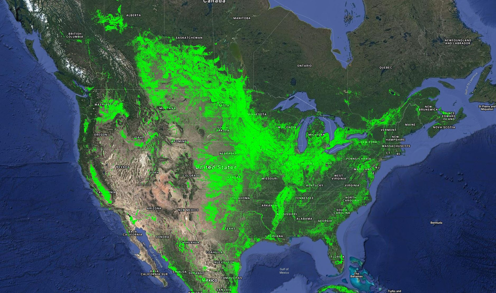

# GFSAD30 Cropland extent

Google Earth Engine Codes for development of Cropland extent for North America 2010

The cropland extent can be viewed at: https://croplands.org

The cropland extent product can be downloaded from: https://e4ftl01.cr.usgs.gov/MEASURES/GFSAD30NACE.001/2008.01.01/

Product documentation is available at: 
1) North America 2010 product: https://lpdaac.usgs.gov/products/gfsad30nacev001/
2) Global cropland extent validation: https://lpdaac.usgs.gov/documents/169/GFSAD30VAL_ATBD.pdf

The associated paper can be viewed at: https://www.sciencedirect.com/science/article/abs/pii/S0034425718304619

